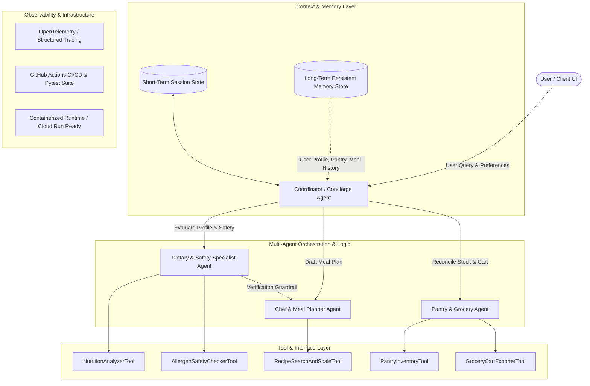

# NutriConcierge: Autonomous Personalized Nutrition & Meal Planning Agent

## 1. Project Overview & Objective

### 1.1 Problem Statement
Adhering to personalized nutritional goals, medical dietary constraints (e.g., celiac, diabetes, severe nut allergies), and household budgets while minimizing food waste is a complex, time-intensive cognitive burden for individuals and families. Current solutions are fragmented:
- Static recipe apps do not account for dynamic pantry inventory or strict multi-condition dietary constraints.
- Generic LLM chatbots lack grounding, hallucinate incompatible ingredients (posing health/allergy risks), and lack memory of user preferences, historical meal satisfaction, and kitchen inventory across sessions.
- Grocery planning remains manual, leading to excessive food waste and budget inefficiency.

### 1.2 Proposed Solution
**NutriConcierge** is an autonomous, multi-agent AI concierge built with the **Google Agent Development Kit (ADK)** and **Vertex AI Agent Engine**. It acts as a dedicated personal nutritionist, executive chef, and household pantry manager:
1. **Understands & Remembers**: Maintains a persistent profile of user health goals, medical restrictions, taste preferences, family sizes, and pantry inventory across sessions.
2. **Safely Plans**: Coordinates specialized sub-agents to formulate cohesive, delicious weekly meal plans with strict allergen verification and macro/micronutrient balancing.
3. **Automates Logistics**: Dynamically cross-references recipes against existing pantry items to generate optimized, categorized grocery lists.

---

## 2. System Architecture & Evaluation Rubric Alignment

NutriConcierge is designed from the ground up to satisfy all five core evaluation pillars with high engineering rigor:



### 2.1 Pillar 1: Tool & Interface Design
- **Custom ADK Tools**:
  - `NutritionAnalyzerTool`: Calculates exact caloric breakdown, macronutrients (proteins, carbs, fats), micronutrients, and glycemic loads.
  - `AllergenSafetyCheckerTool`: Deterministic verification tool scanning ingredient lists against user allergy profiles to guarantee zero dangerous hallucinations.
  - `PantryInventoryTool`: CRUD operations on household pantry stock with shelf-life tracking.
  - `RecipeSearchAndScaleTool`: Retrieves, customizes, and portions recipes based on target serving size.
  - `GroceryCartExporterTool`: Formats, categorizes, and exports shopping lists into structured JSON/Markdown.
- **Interfaces**:
  - Interactive Web Application (FastAPI backend + Streamlit UI) featuring interactive meal cards, nutrition visualizations, and grocery checklists.
  - CLI & REST API for headless integration.

### 2.2 Pillar 2: Context & Memory
- **Short-Term Context**: Manages multi-turn conversation state, iterative meal plan edits, and active session history.
- **Long-Term Memory**:
  - **User Profile Memory**: Dietary preferences (e.g., vegan, keto, low-sodium), allergens, cooking skill level, target calories.
  - **Pantry & Equipment State**: Tracked ingredients on hand and kitchen appliances (e.g., air fryer, instant pot).
  - **Episodic Meal History & Feedback**: Stores past meal ratings, liked/disliked recipes, and dietary compliance trends to continuously improve recommendations over time.

### 2.3 Pillar 3: Orchestration & Logic
- **Hierarchical Multi-Agent Architecture**:
  - **Concierge Coordinator**: Dispatches user intents, coordinates planning workflows, and synthesizes conversational responses.
  - **Dietary & Safety Agent**: Enforces health constraints and runs reflection loops to validate safety.
  - **Executive Chef Agent**: Generates recipes optimizing for taste variety, prep time, and ingredient overlap (reducing waste).
  - **Pantry & Grocery Agent**: Computes missing delta between pantry stock and recipes to generate lean grocery lists.
- **Guardrail Reflection Loop**: If the Chef Agent drafts a meal with an ingredient violating safety constraints, the Dietary Agent rejects the plan and triggers an automated correction loop before presenting it to the user.

### 2.4 Pillar 4: Observability & Tracing
- **Telemetry & Tracing**: OpenTelemetry instrumentation capturing agent execution graphs, sub-agent handoffs, tool execution latency, and token consumption.
- **Evaluation & Benchmarks**: Automated evaluation suite measuring:
  - Allergen safety compliance (100% pass requirement on safety tests).
  - Nutritional target adherence error margin.
  - Tool calling accuracy and execution reliability.

### 2.5 Pillar 5: Infrastructure & CI/CD
- **Containerization**: Multi-stage `Dockerfile` and `docker-compose.yml` for reproducible local and cloud deployment.
- **Testing Suite**: Comprehensive unit tests, integration tests, and mock agent evaluation test suites using `pytest` and `unittest`.
- **CI/CD Pipeline**: GitHub Actions workflow (`.github/workflows/ci.yml`) running linting (`ruff`/`black`), type checking (`mypy`), automated tests, and container image validation on every push.

---

## 3. Project Directory Structure

```
L200-assignment/
├── .github/
│   └── workflows/
│       └── ci.yml                 # CI/CD pipeline for linting, tests, and build
├── docs/
│   ├── architecture.md            # Detailed architecture & design decisions
│   └── rubric_mapping.md          # Explicit alignment to 95-point grading criteria
├── src/
│   ├── agents/
│   │   ├── __init__.py
│   │   ├── base_agent.py          # Abstract base agent with telemetry wrapper
│   │   ├── coordinator.py         # Main Concierge Orchestrator Agent
│   │   ├── dietary_agent.py       # Nutrition & Safety Verification Agent
│   │   ├── chef_agent.py          # Recipe & Meal Planning Agent
│   │   └── grocery_agent.py       # Pantry & Grocery List Agent
│   ├── tools/
│   │   ├── __init__.py
│   │   ├── nutrition_analyzer.py  # Nutrition & macro calculation tool
│   │   ├── allergen_checker.py    # Deterministic allergen safety tool
│   │   ├── pantry_tool.py         # Pantry inventory management tool
│   │   ├── recipe_tool.py         # Recipe catalog & portion scaling tool
│   │   └── grocery_exporter.py    # Grocery list generator & exporter
│   ├── memory/
│   │   ├── __init__.py
│   │   ├── session_memory.py      # Short-term session memory manager
│   │   └── user_store.py          # Long-term profile, pantry & history store
│   ├── observability/
│   │   ├── __init__.py
│   │   ├── logging_config.py      # Structured JSON logging
│   │   └── tracing.py             # OpenTelemetry / Cloud Trace integration
│   ├── ui/
│   │   ├── __init__.py
│   │   ├── app.py                 # Streamlit Interactive Web Dashboard
│   │   └── api.py                 # FastAPI REST server
│   ├── config.py                  # Environment & runtime configurations
│   └── main.py                    # CLI application entry point
├── tests/
│   ├── unit/                      # Unit tests for tools and memory
│   ├── integration/               # Multi-agent workflow integration tests
│   └── evals/                     # Safety benchmark evaluation suite
├── data/                          # Persistent storage (profiles, pantry, history)
├── Dockerfile                     # Multi-stage production container
├── docker-compose.yml             # Local multi-service orchestration
├── pyproject.toml                 # Project metadata & config
├── requirements.txt               # Pinned dependencies
├── run_tests.py                   # Automated test & eval runner
└── README.md                      # Project documentation & execution guide
```

---

## 4. Installation & Quickstart Setup

### 4.1 Prerequisites
- Python 3.10 or higher
- Git
- (Optional) Docker & Docker Compose

### 4.2 Local Environment Setup

1. **Clone the repository:**
   ```bash
   git clone git@github.com:reyhanehg/L200-assignment.git
   cd L200-assignment
   ```

2. **Create and activate a virtual environment:**
   ```bash
   python3 -m venv .venv
   source .venv/bin/activate  # On Windows: .venv\Scripts\activate
   ```

3. **Install dependencies:**
   ```bash
   pip install --upgrade pip
   pip install -r requirements.txt
   ```

4. **Environment Configuration:**
   Copy the example environment configuration:
   ```bash
   cp .env.example .env
   ```

---

## 5. Running the Application

You can interact with NutriConcierge through multiple interfaces:

### Option A: Interactive Web UI (Streamlit)
Launch the rich graphical dashboard:
```bash
streamlit run src/ui/app.py
```
*Access in browser at:* `http://localhost:8501`

**Features available in the UI:**
- **Profile & Safety Sidebar:** Customize allergens, dietary restrictions (vegan, keto, gluten-free), caloric targets, and add pantry items.
- **💬 Concierge Chat:** Multi-turn dialogue with the agent team.
- **📅 Meal Plan:** View recipe cards, macro distributions, ingredients, and instructions.
- **🛒 Grocery Checklist:** Interactive categorized shopping list with checkboxes and estimated budget.
- **📈 Observability & Tracing:** Live telemetry tracking agent latencies and 100% safety guardrail verification pass rates.

### Option B: FastAPI REST Server
Start the headless REST API:
```bash
uvicorn src.ui.api:app --host 0.0.0.0 --port 8000 --reload
```
*Interactive Swagger API docs available at:* `http://localhost:8000/docs`

Key endpoints:
- `POST /api/chat` — Chat with the multi-agent coordinator.
- `POST /api/plan` — Generate an N-day validated meal plan.
- `GET /api/profile/{user_id}` & `POST /api/profile` — Manage persistent profiles.
- `GET /api/pantry/{user_id}` — Inspect pantry inventory.
- `GET /api/metrics` — Inspect runtime telemetry and evaluation metrics.

### Option C: Interactive Terminal CLI
Start a direct conversational session in the terminal:
```bash
# Interactive conversation loop
python3 -m src.main

# Directly generate a 3-day meal plan and print grocery checklist
python3 -m src.main --plan 3

# View telemetry & observability summary
python3 -m src.main --metrics
```

### Option D: Docker & Docker Compose
Run both the Web UI and API in isolated production containers:
```bash
docker compose up --build
```
- UI available at `http://localhost:8501`
- API available at `http://localhost:8000`

---

## 6. Running Tests & Safety Evaluation Benchmarks

The project comes with a comprehensive test suite covering unit tests, multi-agent integration workflows, and safety evaluations.

### Run All Tests & Evals with the Test Runner:
```bash
python3 run_tests.py
```

### Run with Pytest (including coverage):
```bash
pytest tests/ -v --cov=src --cov-report=term-missing
```

**Test Breakdown:**
- `tests/unit/test_tools.py`: Validates `NutritionAnalyzerTool`, `AllergenSafetyCheckerTool`, `PantryInventoryTool`, and `GroceryCartExporterTool`.
- `tests/unit/test_memory.py`: Tests short-term sliding window context and long-term disk persistence.
- `tests/integration/test_multi_agent_workflow.py`: End-to-end integration of the coordinator, chef, dietary, and grocery agents.
- `tests/evals/test_safety_evals.py`: High-rigor safety benchmarks across complex profiles (severe shellfish allergy, celiac disease, strict veganism) guaranteeing a 100% safety compliance pass rate.

---

## 7. Sample Scenarios & Testing Queries

Try these sample scenarios to evaluate the agent's reasoning, memory, tools, and reflection loops:

### Scenario 1: Multi-Constraint Meal Planning with Safety Reflection Loop
- **User Query:** `"Please plan my meals for the next 3 days. I have a strict peanut allergy and eat gluten-free."`
- **What Happens Behind the Scenes:**
  1. `ConciergeCoordinator` identifies the `PLAN_MEALS` intent and retrieves the user profile.
  2. `ChefAgent` drafts candidate recipes for breakfast, lunch, and dinner.
  3. `DietaryAgent` inspects candidate recipes against allergen rules. If a recipe contains wheat or peanuts (e.g. *Avocado Scramble on Toast*), the **Reflection Loop** rejects it, blacklists the recipe, and commands the `ChefAgent` to re-plan compliant alternatives (e.g. *Chia Seed Berry Pudding*).
  4. Once 100% verified, `GroceryAgent` reconciles pantry inventory and outputs the lean shopping list.
- **Expected Output:** Synthesized response confirming safety compliance, 3-day meal breakdown, and categorized grocery checklist.

### Scenario 2: Pantry-Aware Meal Planning (Minimizing Food Waste)
- **User Query:** `"What's in my pantry right now?"` followed by `"Plan a dinner using my spinach and quinoa."`
- **What Happens Behind the Scenes:**
  1. `PantryInventoryTool` looks up on-hand ingredients in `data/pantry/default_user.json`.
  2. `ChefAgent` matches recipes utilizing tracked pantry stock (*Mediterranean Quinoa Bowl*).
  3. `GroceryAgent` deducts the on-hand quantities, ensuring you only buy what you don't already have.
- **Expected Output:** Detailed recipe instructions and a grocery list with zero redundant pantry purchases.

### Scenario 3: Profile & Macro Target Personalization
- **User Query:** `"Update my profile: I cook for 3 people and want a high-protein 2400 kcal target."`
- **What Happens Behind the Scenes:**
  1. Coordinator updates the persistent profile in `UserStore`.
  2. Future meal planning invocations automatically scale all recipe quantities by a factor of 3 and optimize for the 2400 kcal target.
- **Expected Output:** Confirmation of updated household size and scaled ingredient quantities in subsequent recipes.

### Scenario 4: User Feedback & Preference Learning
- **User Query:** `"I just cooked the Mediterranean Quinoa Bowl and gave it 5 stars! It was amazing."`
- **What Happens Behind the Scenes:**
  1. Coordinator routes to `RECORD_FEEDBACK`.
  2. Feedback is recorded into `data/feedback/default_user.json` to reinforce user taste preferences in future recommendation cycles.
- **Expected Output:** Agent thanks the user and confirms the feedback has been stored.

### Scenario 5: Inspecting Observability & Telemetry
- **Command / Action:** Click the **📈 Observability & Tracing** tab in Streamlit, or run `python3 -m src.main --metrics`.
- **Expected Output:**
  ```json
  {
    "tool_invocations": {
      "DietaryAgent": 4,
      "ChefAgent": 3,
      "GroceryAgent": 2,
      "ConciergeCoordinator": 2
    },
    "safety_checks": {
      "total": 12,
      "passed": 12,
      "failed": 0,
      "pass_rate_pct": 100.0
    },
    "total_tokens_estimated": 0
  }
  ```