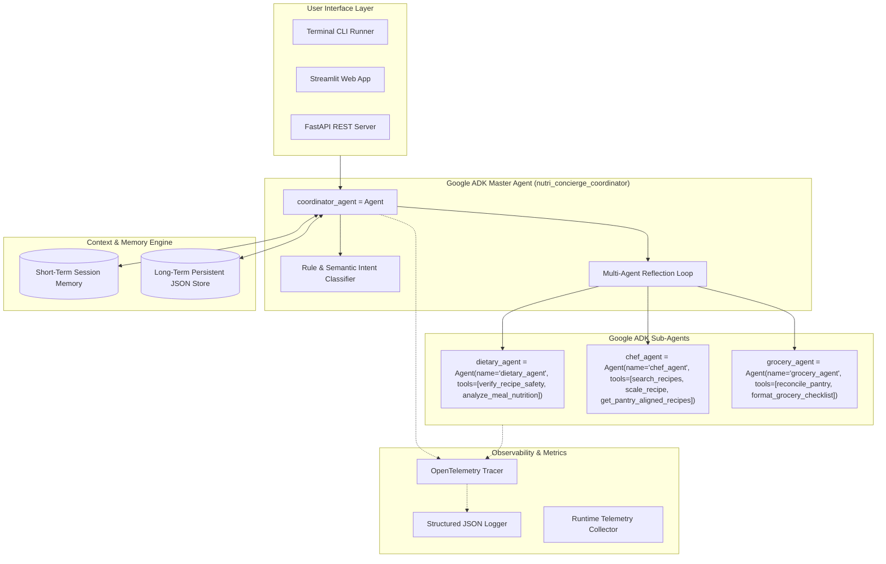

# NutriConcierge Architecture & Design Specification (Google ADK)

## 1. System Overview
NutriConcierge is an autonomous multi-agent system built directly with the **Google Agent Development Kit (ADK)** (`google.adk`). It coordinates specialized LLM agents and deterministic tool functions to solve the cognitive load, health risks, and food waste challenges associated with personalized meal planning and grocery logistics.



---

## 2. Google ADK Agent Architecture

All agents in NutriConcierge are instantiated directly as native Google ADK `Agent` objects (`from google.adk import Agent`):

### 2.1 Google ADK Agent Definitions
1. **Master Coordinator Agent (`src/agents/coordinator.py`)**:
   ```python
   coordinator_agent = Agent(
       name="nutri_concierge_coordinator",
       model="gemini-1.5-pro",
       instruction="You are NutriConcierge, the master autonomous AI concierge...",
       sub_agents=[dietary_agent, chef_agent, grocery_agent],
   )
   ```
2. **Dietary & Safety Specialist Agent (`src/agents/dietary_agent.py`)**:
   ```python
   dietary_agent = Agent(
       name="dietary_agent",
       model="gemini-1.5-pro",
       instruction="You are the Dietary & Safety Specialist Agent...",
       tools=[verify_recipe_safety, analyze_meal_nutrition],
   )
   ```
3. **Executive Chef Planner Agent (`src/agents/chef_agent.py`)**:
   ```python
   chef_agent = Agent(
       name="chef_agent",
       model="gemini-1.5-pro",
       instruction="You are the Executive Chef & Meal Planner Agent...",
       tools=[search_recipes_by_criteria, scale_recipe_portions, get_pantry_aligned_recipes],
   )
   ```
4. **Pantry & Grocery Manager Agent (`src/agents/grocery_agent.py`)**:
   ```python
   grocery_agent = Agent(
       name="grocery_agent",
       model="gemini-1.5-pro",
       instruction="You are the Pantry & Grocery Manager Agent...",
       tools=[reconcile_pantry_and_generate_cart, format_grocery_markdown_checklist],
   )
   ```

### 2.2 Safety Reflection & Self-Correction Loop
When a candidate meal plan contains an allergen (e.g. peanuts for an allergic user) or violates a dietary constraint (e.g. meat in a vegan plan):
1. `dietary_agent` marks `is_safe = False` and outputs the offending ingredient.
2. `coordinator_agent` catches the violation, temporarily excludes the offending recipe, and commands `chef_agent` to re-plan compliant alternatives.
3. `dietary_agent` re-audits until 100% compliance is guaranteed.

---

## 3. Memory & Context Design

- **Short-Term Session Memory (`src/memory/session_memory.py`)**:
  - In-memory sliding window deque tracking multi-turn dialogue, active intent, and current working meal plan draft.
- **Long-Term Persistent Memory (`src/memory/user_store.py`)**:
  - File-backed JSON store in `data/`.
  - Persists user dietary profiles, allergens, calorie targets, pantry inventory, historical meal plans, and recipe feedback ratings across sessions.

---

## 4. Observability, Telemetry & Tracing

- **OpenTelemetry Spans (`src/observability/tracing.py`)**:
  - Each agent step and tool invocation is instrumented with an OpenTelemetry span recording duration, status, and telemetry attributes.
- **Runtime Metrics Collector**:
  - Measures total tool calls, agent latencies, safety validation pass rates, and estimated token counts.
- **Structured JSON Logging (`src/observability/logging_config.py`)**:
  - Emits machine-readable logs with timestamps, log levels, session IDs, and durations.
